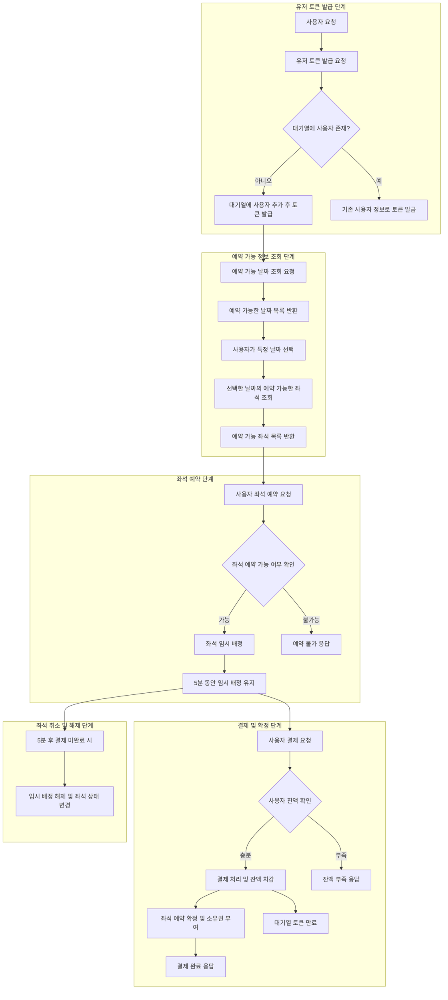
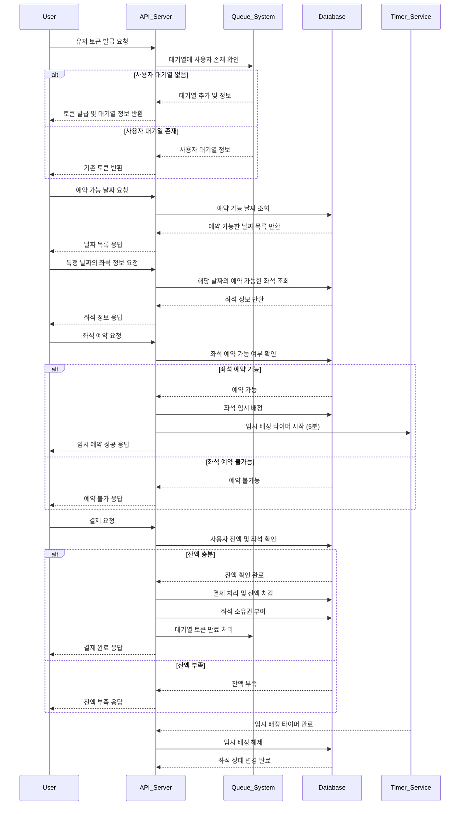
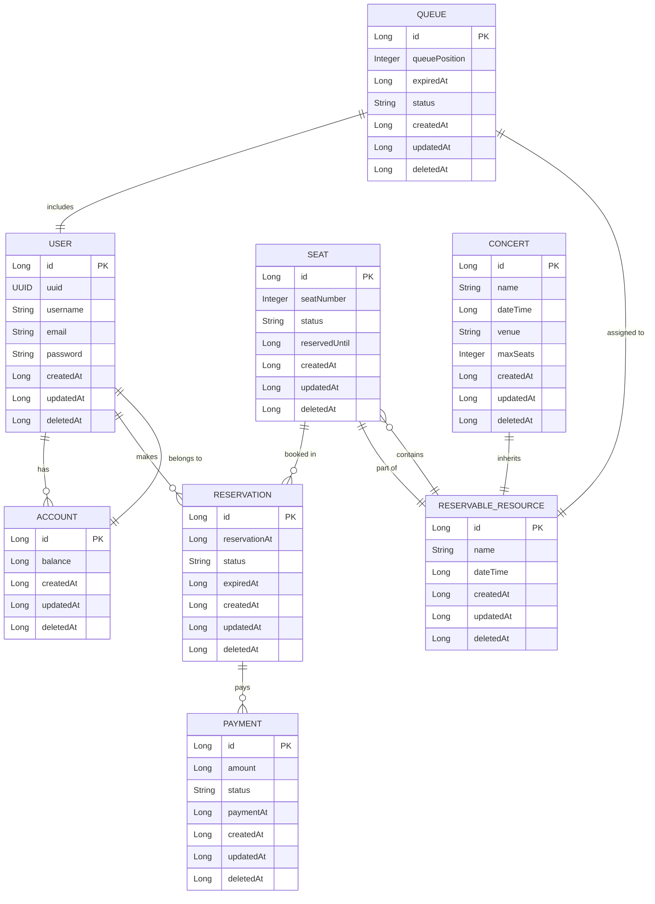

# 콘서트 예약 서비스

---

## 목차

- [콘서트 예약 서비스](#콘서트-예약-서비스)
  - [목차](#목차)
  - [1. 시나리오 선정 및 프로젝트 Milestone](#1-시나리오-선정-및-프로젝트-milestone)
    - [시나리오 선정](#시나리오-선정)
    - [Milestone](#milestone)
  - [2. 시나리오 요구사항 별 분석 자료](#2-시나리오-요구사항-별-분석-자료)
  - [3. 프로젝트 구조](#3-프로젝트-구조)
    - [프로젝트 기본 정보](#프로젝트-기본-정보)
    - [패키지 구조](#패키지-구조)
  - [4. API 명세](#4-api-명세)
  - [5. ERD 설계 자료](#5-erd-설계-자료)
    - [ERD 다이어그램](#erd-다이어그램)
    - [설명](#설명)

---

## 1. 시나리오 선정 및 프로젝트 Milestone

### 시나리오 선정

- **콘서트 예약 서비스 구축**
    - 사용자 대기열 시스템 구현
    - 좌석 예약 및 임시 배정 기능 구현
    - 잔액 충전 및 결제 시스템 구현
    - 동시성 이슈 및 대기열 처리 고려

### Milestone

1. **프로젝트 초기 설정**
    - 프로젝트 구조 설계
    - 기술 스택 선정
    - 기본적인 엔티티 및 데이터베이스 설계


2. **유저 토큰 발급 기능 구현**
    - UUID 기반의 유저 식별 시스템 구축
    - 대기열 관리 시스템 설계 및 구현
    - 토큰 생성 및 검증 로직 구현


3. **예약 가능 날짜 / 좌석 조회 기능 구현**
    - 예약 가능한 날짜 목록 API 구현
    - 날짜별 예약 가능한 좌석 조회 API 구현
    - 좌석 정보 관리 시스템 설계


4. **좌석 예약 요청 기능 구현**
    - 좌석 임시 배정 시스템 구현
    - 임시 배정 시간 설정 및 관리
    - 동시성 이슈 방지를 위한 락 또는 대기열 처리 로직 구현


5. **잔액 충전 / 조회 기능 구현**
    - 사용자 잔액 관리 시스템 구현
    - 잔액 충전 API 구현
    - 잔액 조회 API 구현


6. **결제 기능 구현**
    - 결제 처리 로직 구현
    - 결제 내역 생성 및 저장
    - 좌석 소유권 배정 및 대기열 토큰 만료 처리


7. **테스트 코드 작성 및 검증**
    - 각 기능별 단위 테스트 작성
    - 통합 테스트 및 부하 테스트 진행
    - 동시성 및 대기열 처리 검증


8. **프로젝트 배포 및 모니터링 설정**
    - 모니터링 및 로깅 시스템 구축
    - 성능 최적화 및 버그 수정

---

## 2. 시나리오 요구사항 별 분석 자료





---

## 3. 프로젝트 구조

### 프로젝트 기본 정보

- **Language**: Kotlin
- **Framework**: Spring Boot 3.3.4
- **Database**: PostgreSQL, H2 (for testing)
- **ORM**: Spring Data JPA, QueryDSL
- **Caching**: Redis
- **Message Queue**: Kafka (event streaming)
- **Build Tool**: Gradle
- **Java Version**: 21

### 패키지 구조

```
rest_server
 ┣ admin                        # 어드민 관련 기능 (콘서트 관리, 사용자 관리 등)
 ┣ application                  # 애플리케이션 레이어 (파서드 로직)
 ┣ config                       # 설정 파일 (QueryDSL, Redis, Security 등)
 ┃ ┗ QueryDslConfig.kt          
 ┣ domain                       # 도메인 레이어 (각 도메인의 비즈니스 로직)
 ┃ ┣ auth                       # 인증 관련 도메인 (유저, 토큰)
 ┃ ┣ concert                    # 콘서트 관련 도메인 (콘서트 정보, 좌석 정보)
 ┃ ┃ ┗ seat                     # 좌석 관련 도메인 (좌석 예약, 좌석 상태)
 ┃ ┣ payment                    # 결제 관련 도메인 (결제, 결제 내역)
 ┃ ┗ user                       # 사용자 관련 도메인 (사용자 정보, 잔액)
 ┣ interfaces                   # 프레젠테이션 레이어 (API 및 DTO)
 ┃ ┣ api                        # API 컨트롤러
 ┃ ┃ ┗ concert                  # 콘서트 관련 API 컨트롤러
 ┃ ┗ dto                        # DTO 클래스 (요청/응답 정의)
 ┗ RestServerApplication.kt     # 애플리케이션 엔트리 포인트
```

---

## 4. API 명세

| **Method** | **Endpoint**                                                                            | **Description**                   | **Request Body**                                                                        | **Response Example**                                                                                                                                                                                                                           | **Error Example**                                                                                        |
| ---------- | --------------------------------------------------------------------------------------- | --------------------------------- | --------------------------------------------------------------------------------------- | ---------------------------------------------------------------------------------------------------------------------------------------------------------------------------------------------------------------------------------------------- | -------------------------------------------------------------------------------------------------------- |
| `POST`     | `/api/v1/token`                                                                         | 유저 대기열 토큰 발급             | `{ "userId": "123e4567-e89b-12d3-a456-426614174000" }`                                  | `{ "result": "success", "body": { "token": "JWT_TOKEN", "queuePosition": 1, "estimatedWaitTime": 120 } }`                                                                                                                                      | `{ "result": "error", "body": { "code": 404, "message": "User not found." } }`                           |
| `GET`      | `/api/v1/seats/dates`                                                                   | 예약 가능한 날짜 목록 조회        | N/A                                                                                     | `{ "result": "success", "body": { "dates": ["2024-10-15", "2024-10-16", "2024-10-17"] } }`                                                                                                                                                     | `{ "result": "error", "body": { "code": 500, "message": "Failed to retrieve available dates." } }`       |
| `GET`      | `/api/v1/seats/available?date=2024-10-15`                                               | 특정 날짜의 예약 가능한 좌석 조회 | N/A                                                                                     | `{ "result": "success", "body": { "date": "2024-10-15", "availableSeats": [1, 2, 3, 5, 10, 20] } }`                                                                                                                                            | `{ "result": "error", "body": { "code": 404, "message": "No seats available for the selected date." } }` |
| `POST`     | `/api/v1/seats/reserve`                                                                 | 특정 좌석 임시 예약 요청          | `{ "userId": "123e4567-e89b-12d3-a456-426614174000", "date": "2024-10-15", "seat": 5 }` | `{ "result": "success", "body": { "status": "reserved", "seatNumber": 5, "expiresIn": 300 } }`                                                                                                                                                 | `{ "result": "error", "body": { "code": 409, "message": "Seat is already reserved." } }`                 |
| `POST`     | `/api/v1/users/{userId}/balance/charge`                                                 | 사용자 잔액 충전                  | `{ "amount": 10000 }`                                                                   | `{ "result": "success", "body": { "userId": "123e4567-e89b-12d3-a456-426614174000", "newBalance": 20000 } }`                                                                                                                                   | `{ "result": "error", "body": { "code": 400, "message": "Invalid charge amount." } }`                    |
| `GET`      | `/api/v1/users/{userId}/balance`                                                        | 사용자 잔액 조회                  | N/A                                                                                     | `{ "result": "success", "body": { "userId": "123e4567-e89b-12d3-a456-426614174000", "balance": 15000 } }`                                                                                                                                      | `{ "result": "error", "body": { "code": 404, "message": "User not found." } }`                           |
| `POST`     | `/api/v1/seats/payment`                                                                 | 결제 요청                         | `{ "userId": "123e4567-e89b-12d3-a456-426614174000", "date": "2024-10-15", "seat": 5 }` | `{ "result": "success", "body": { "status": "paid", "userId": "123e4567-e89b-12d3-a456-426614174000", "seatNumber": 5, "amount": 5000, "paidAt": "2024-10-15T14:00:00Z" } }`                                                                   | `{ "result": "error", "body": { "code": 400, "message": "Insufficient balance." } }`                     |
| `DELETE`   | `/api/v1/seats/cancel`                                                                  | 좌석 임시 예약 취소 요청          | `{ "userId": "123e4567-e89b-12d3-a456-426614174000", "date": "2024-10-15", "seat": 5 }` | `{ "result": "success", "body": { "status": "canceled", "seatNumber": 5, "canceledAt": "2024-10-15T10:02:00Z" } }`                                                                                                                             | `{ "result": "error", "error": { "code": 404, "message": "Reservation not found." } }`                   |
| `GET`      | `/api/v1/concerts`                                                                      | 예약 가능한 콘서트 목록 조회      | N/A                                                                                     | `{ "result": "success", "body": { "concerts": [ { "concertId": "c1", "title": "Spring Festival", "description": "A spring concert for all", "availableDates": ["2024-10-15", "2024-10-16"] } ] } }`                                            | `{ "result": "error", "body": { "code": 500, "message": "Failed to retrieve concerts." } }`              |
| `GET`      | `/api/v1/concerts/{concertId}/reservations?userId=123e4567-e89b-12d3-a456-426614174000` | 사용자의 예약된 좌석 목록 조회    | N/A                                                                                     | `{ "result": "success", "body": { "concertId": "c1", "userId": "123e4567-e89b-12d3-a456-426614174000", "reservations": [{ "seatNumber": 5, "status": "paid", "reservedAt": "2024-10-15T10:00:00Z", "expiresAt": "2024-10-15T10:05:00Z" }] } }` | `{ "result": "error", "body": { "code": 404, "message": "No reservations found for this concert." } }`   |

---

## 5. ERD 설계 자료

### ERD 다이어그램



### 설명
- **USER:** 사용자의 기본 정보를 관리하는 엔티티입니다. 사용자의 ID, UUID, 이메일, 비밀번호 등의 정보를 저장하며, 관련된 Account 엔티티를 통해 잔액 정보도 관리됩니다. 또한, Reservation 엔티티와의 관계를 통해 좌석 예약 정보를 관리합니다.
  - User는 잔액 충전을 위한 Account와, 좌석 예약을 위한 Reservation과 관련이 있습니다.

- **ACCOUNT**: 사용자의 잔액 정보를 저장하는 엔티티입니다. User 엔티티와 1:1 관계를 가지며, 사용자는 잔액을 충전하거나 사용할 수 있습니다.

- **CONCERT**: 콘서트 정보를 관리하는 엔티티입니다. 각 콘서트의 이름, 날짜, 장소, 최대 좌석 수 등의 정보가 저장됩니다. 콘서트는 ReservableResource 엔티티를 상속받아 다른 자원과 통합된 구조를 갖습니다.
  - Concert는 다양한 공연 정보를 확장할 수 있도록 ReservableResource를 상속받으며, 여러 Seat을 포함합니다.

- **SEAT**: 각 콘서트의 좌석 정보를 저장하는 엔티티입니다. 좌석 번호, 예약 상태(예약 가능, 예약됨), 좌석이 예약된 시점 및 만료 시점 등을 관리합니다. 좌석은 Concert와 ReservableResource에 연결됩니다.

- **RESERVATION**: 사용자의 좌석 예약 정보를 관리하는 엔티티입니다. 예약 시점, 만료 시점, 예약 상태(대기, 예약 확정, 취소됨) 등이 저장되며, User와 Seat 엔티티와 연결됩니다.

- **TOKEN**: 사용자 대기열 상태를 관리하는 엔티티입니다. User 엔티티와 연결되어 대기열에서의 위치, 만료 시점 등의 정보를 저장하며, 대기열이 만료되지 않은 사용자는 예약 서비스에 접근할 수 있도록 합니다.
  - Token은 사용자 대기열 상태를 관리하여 API 요청 시 대기열에서의 순번과 만료 여부를 확인합니다.
  
- **PAYMENT**: 좌석 예약과 관련된 결제 내역을 관리하는 엔티티입니다. 결제 금액, 상태(대기 중, 완료됨, 실패), 결제 시점 등의 정보를 저장하며, Reservation 엔티티와 연결되어 특정 좌석 예약과 관련된 결제 내역을 관리합니다.
  - Payment는 예약과 연결되어 결제 내역을 관리합니다.

<!-- - **CONCERT**: 콘서트 정보를 관리하는 엔티티입니다.
- **SEAT**: 각 콘서트의 날짜별 좌석 정보를 저장합니다.
- **USER**: 사용자 정보를 관리하며, 잔액 정보를 포함합니다.
- **TOKEN**: 사용자 대기열 상태를 관리하기 위한 토큰 정보입니다.
- **PAYMENT**: 좌석 예약과 관련된 결제 내역을 관리합니다. -->

---