# 콘서트 예약 서비스

## 프로젝트 개요

**콘서트 예약 서비스**는 사용자들이 콘서트 좌석을 예약하고 결제할 수 있는 시스템입니다. 

이 서비스는 대기열 시스템을 도입하여 사용자들이 순서대로 예약을 진행할 수 있도록 하며, 좌석 예약 시 결제가 이루어지지 않더라도 일정 시간 동안 다른 사용자가 해당 좌석에 접근할 수 없도록 합니다.

---

## 목차

1. [시나리오 선정 및 프로젝트 Milestone](#1-시나리오-선정-및-프로젝트-milestone)
2. [시나리오 요구사항 별 분석 자료](#2-시나리오-요구사항-별-분석-자료)
    - [유저 토큰 발급 API](#유저-토큰-발급-api)
    - [예약 가능 날짜 / 좌석 API](#예약-가능-날짜--좌석-api)
    - [좌석 예약 요청 API](#좌석-예약-요청-api)
    - [잔액 충전 / 조회 API](#잔액-충전--조회-api)
    - [결제 API](#결제-api)

---

## 1. 시나리오 선정 및 프로젝트 Milestone

### 시나리오 선정
- **콘서트 예약 서비스 구축**
    - 사용자 대기열 시스템 구현
    - 좌석 예약 및 임시 배정 기능 구현
    - 잔액 충전 및 결제 시스템 구현
    - 동시성 이슈 및 대기열 처리 고려

### Milestone

1. **프로젝트 초기 설정**
    - 프로젝트 구조 설계
    - 기술 스택 선정
    - 기본적인 엔티티 및 데이터베이스 설계

2. **유저 토큰 발급 기능 구현**
    - UUID 기반의 유저 식별 시스템 구축
    - 대기열 관리 시스템 설계 및 구현
    - 토큰 생성 및 검증 로직 구현

3. **예약 가능 날짜 / 좌석 조회 기능 구현**
    - 예약 가능한 날짜 목록 API 구현
    - 날짜별 예약 가능한 좌석 조회 API 구현
    - 좌석 정보 관리 시스템 설계

4. **좌석 예약 요청 기능 구현**
    - 좌석 임시 배정 시스템 구현
    - 임시 배정 시간 설정 및 관리
    - 동시성 이슈 방지를 위한 락 또는 대기열 처리 로직 구현

5. **잔액 충전 / 조회 기능 구현**
    - 사용자 잔액 관리 시스템 구현
    - 잔액 충전 API 구현
    - 잔액 조회 API 구현

6. **결제 기능 구현**
    - 결제 처리 로직 구현
    - 결제 내역 생성 및 저장
    - 좌석 소유권 배정 및 대기열 토큰 만료 처리

7. **테스트 코드 작성 및 검증**
    - 각 기능별 단위 테스트 작성
    - 통합 테스트 및 부하 테스트 진행
    - 동시성 및 대기열 처리 검증

8. **프로젝트 배포 및 모니터링 설정**
    - 모니터링 및 로깅 시스템 구축
    - 성능 최적화 및 버그 수정

---

## 2. 시나리오 요구사항 별 분석 자료

### 유저 토큰 발급 API

#### 기능 설명

- 사용자가 서비스를 이용하기 위해 대기열 토큰을 발급받습니다.
- 토큰에는 사용자의 UUID와 대기열 정보를 포함합니다.
- 이후 모든 API 호출 시 이 토큰을 이용하여 대기열 검증을 통과해야 합니다.

#### 흐름도 (Flow Chart)

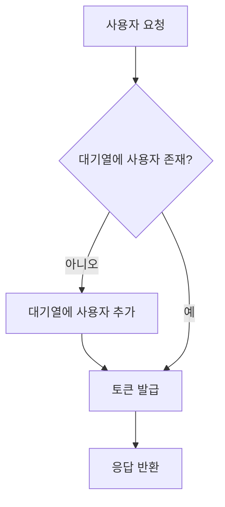

#### 시퀀스 다이어그램

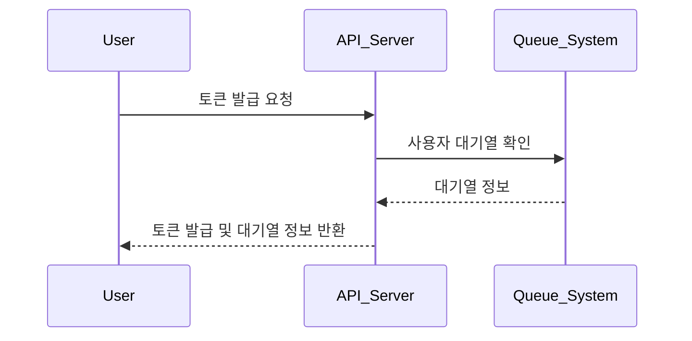

---

### 예약 가능 날짜 / 좌석 API

#### 기능 설명

- 예약 가능한 날짜 목록을 조회합니다.
- 선택한 날짜의 예약 가능한 좌석 정보를 조회합니다.

#### 흐름도

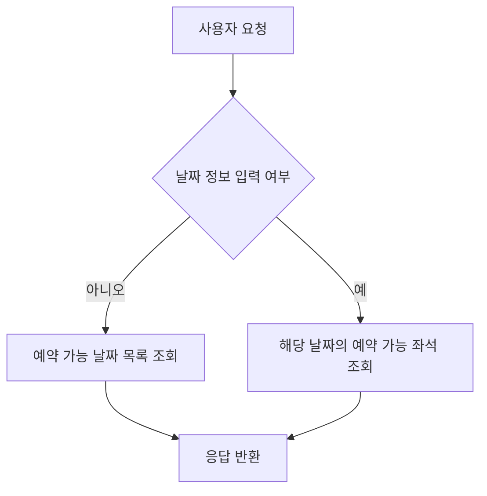

#### 시퀀스 다이어그램

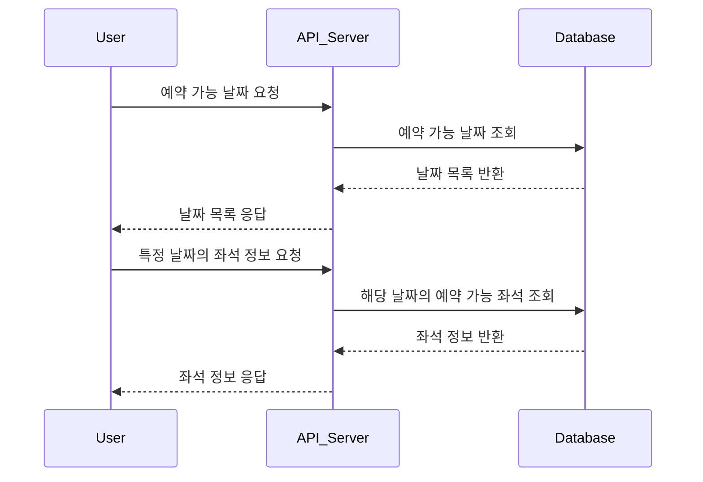

---

### 좌석 예약 요청 API

#### 기능 설명

- 사용자가 좌석 예약을 요청하면 해당 좌석을 일정 시간 동안 임시 배정합니다.
- 임시 배정 시간 내에 결제가 이루어지지 않으면 배정이 해제됩니다.
- 임시 배정된 좌석은 다른 사용자가 예약할 수 없습니다.

#### 흐름도

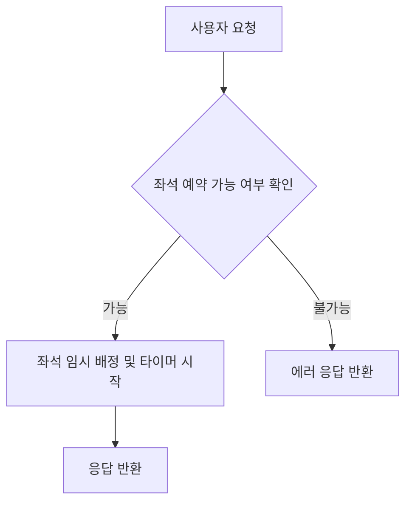

#### 시퀀스 다이어그램

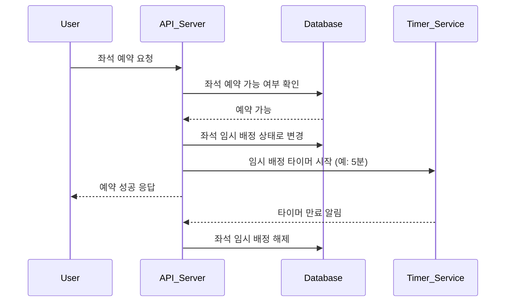

---

### 잔액 충전 / 조회 API

#### 기능 설명

- 사용자가 결제에 사용될 금액을 충전합니다.
- 사용자의 현재 잔액을 조회합니다.

#### 흐름도

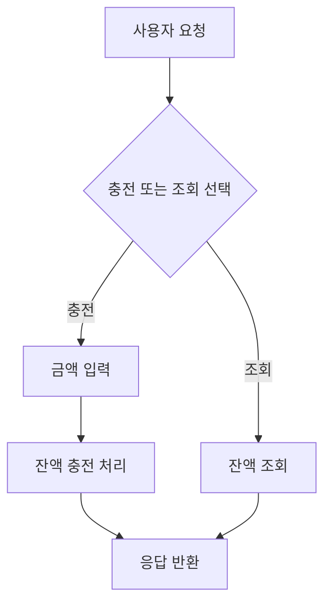

#### 시퀀스 다이어그램 (충전)

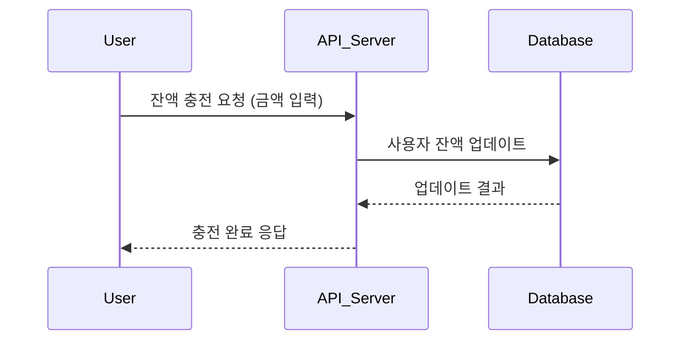

#### 시퀀스 다이어그램 (조회)

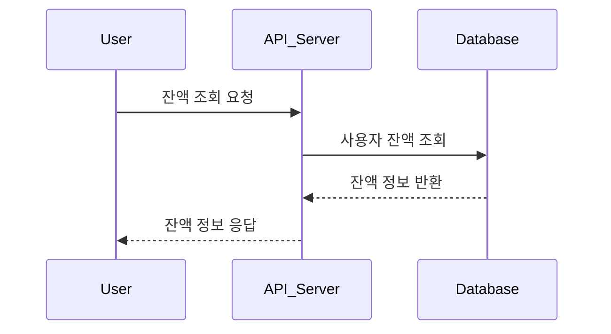

---

### 결제 API

#### 기능 설명

- 임시 배정된 좌석에 대해 결제를 진행합니다.
- 결제 완료 시 좌석의 소유권이 사용자에게 배정되고, 대기열 토큰이 만료됩니다.

#### 흐름도

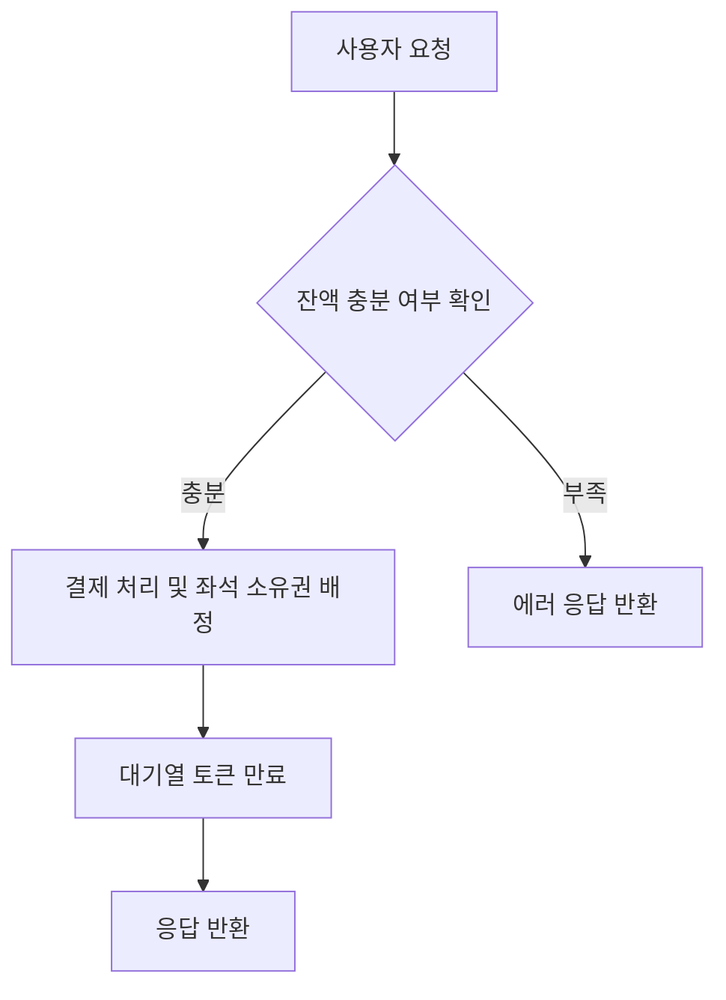

#### 시퀀스 다이어그램

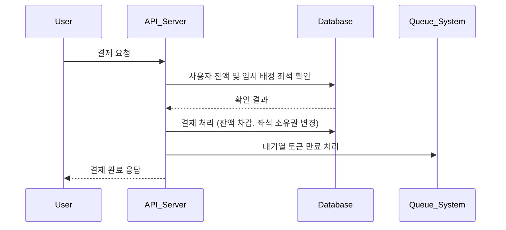

---

## 동시성 이슈 및 대기열 처리 방안

- **대기열 시스템 구현**
    - Redis의 Sorted Set을 이용하여 대기열 관리
    - 사용자 요청 시 대기열에 추가되고, 순서에 따라 토큰 발급

- **동시성 이슈 해결**
    - 좌석 예약 시 데이터베이스에서 비관적 락 사용
    - 임시 배정 타이머는 Redis의 TTL 기능 활용
    - 결제 처리 시 원자성 보장을 위한 트랜잭션 적용

- **다수 인스턴스 환경 지원**
    - Redis를 통한 세션 및 대기열 상태 공유
    - 로드 밸런서를 이용한 트래픽 분산

---

## 단위 테스트

- **각 기능별 단위 테스트 작성**
    - 유저 토큰 발급 및 대기열 관리 테스트
    - 예약 가능 날짜 및 좌석 조회 테스트
    - 좌석 예약 요청 및 임시 배정 테스트
    - 잔액 충전 및 조회 테스트
    - 결제 처리 및 좌석 소유권 배정 테스트
  

- **동시성 시나리오 테스트**
    - 다수의 사용자들이 동시에 좌석 예약을 시도하는 상황 시뮬레이션
    - 임시 배정 시간 만료 후 다른 사용자가 예약할 수 있는지 확인
  
---