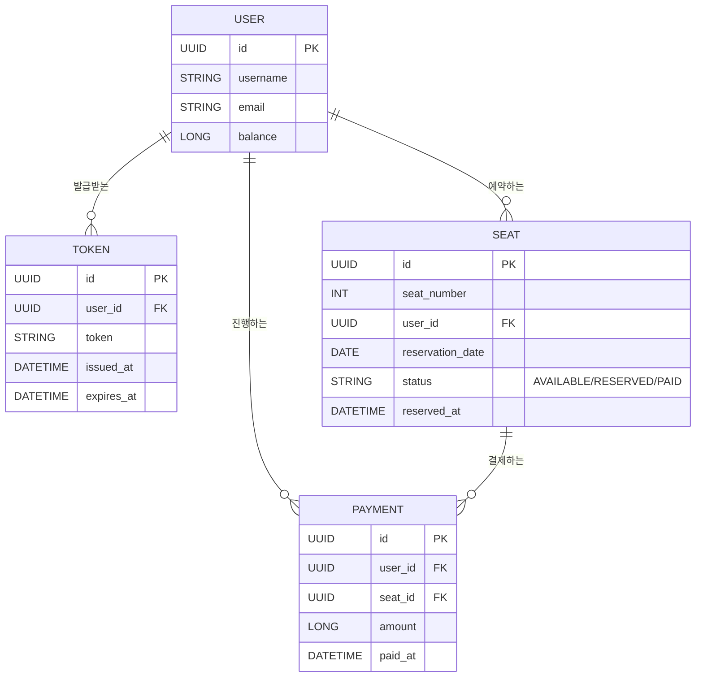

# 콘서트 예약 서비스

## 프로젝트 개요

**콘서트 예약 서비스**는 사용자들이 콘서트 좌석을 예약하고 결제할 수 있는 시스템입니다. 이 서비스는 **대기열 시스템**을 통해 사용자들이 공정하게 순서대로 예약할 수 있도록 하며, 좌석 예약 시 결제가 이루어지지 않더라도 일정 시간 동안 해당 좌석에 다른 사용자가 접근할 수 없도록 합니다. 높은 동시성 요청에도 안정적인 예약 처리를 보장하는 것을 목표로 합니다.

---

## 목차

1. [프로젝트 Milestone 및 진행 계획](#1-프로젝트-milestone-및-진행-계획)
2. [요구사항 분석 및 설계](#2-요구사항-분석-및-설계)
    - [1. 유저 토큰 발급 API](#1-유저-토큰-발급-api)
    - [2. 예약 가능 날짜 / 좌석 API](#2-예약-가능-날짜--좌석-api)
    - [3. 좌석 예약 요청 API](#3-좌석-예약-요청-api)
    - [4. 잔액 충전 / 조회 API](#4-잔액-충전--조회-api)
    - [5. 결제 API](#5-결제-api)
3. [기술 스택 및 아키텍처](#3-기술-스택-및-아키텍처)
4. [동시성 이슈 해결 전략](#4-동시성-이슈-해결-전략)
5. [테스트 및 검증 계획](#5-테스트-및-검증-계획)
6. [API 명세 및 Mock API](#6-api-명세-및-mock-api)
7. [ERD 설계 자료](#7-erd-설계-자료)
8. [README.md 작성 및 PR 제출](#8-readme.md-작성-및-pr-제출)

---

## 1. 프로젝트 Milestone 및 진행 계획

### Milestone

1. **프로젝트 셋업 및 초기 설계**
    - 기술 스택 선정 및 프로젝트 구조 설계
    - 데이터베이스 모델링 및 ERD 설계
    - 대기열 및 예약 상태를 관리할 Redis 구조 설계
2. **유저 대기열 토큰 발급 기능 구현**
    - UUID 기반 사용자 식별 시스템 및 토큰 발급 로직
    - Redis를 이용한 대기열 관리 시스템 구현
    - 유저 대기열 상태 조회 기능 추가
3. **예약 가능 날짜 및 좌석 조회 기능 구현**
    - 예약 가능한 날짜 목록 조회 API 구현
    - 날짜별 좌석 정보 조회 API 구현
    - Redis 캐시를 활용한 빠른 조회 성능 최적화
4. **좌석 예약 요청 기능 구현**
    - 좌석 임시 예약 및 타이머 기반 배정 관리
    - 5분 내 결제되지 않은 예약의 자동 해제 처리
    - Redis의 TTL 기능을 활용한 임시 배정 상태 관리
5. **잔액 충전 및 조회 기능 구현**
    - 사용자 잔액 충전 API 및 잔액 조회 API 구현
    - 결제 시 잔액 차감 및 거래 내역 기록
6. **결제 및 좌석 소유권 배정 기능 구현**
    - 결제 프로세스 및 결제 내역 생성 로직
    - 좌석의 소유권 사용자에게 배정 및 대기열 토큰 만료 처리
7. **다수의 인스턴스 환경 테스트 및 배포**
    - 무중단 배포를 위한 CI/CD 파이프라인 구축
    - 동시성 시나리오 테스트 및 부하 테스트
    - 안정적인 운영을 위한 모니터링 및 로깅 설정

---

## 2. 요구사항 분석 및 설계

### 1. 유저 토큰 발급 API

#### 기능 설명

- 사용자가 콘서트 예약 시스템에 접근하기 위한 **대기열 토큰을 발급**받습니다.
- 토큰에는 사용자의 UUID와 대기열 순서, 예상 대기 시간을 포함합니다.
- 대기열에서 사용자의 순서가 되면 다른 API 호출이 가능합니다.

---

### 2. 예약 가능 날짜 / 좌석 API

#### 기능 설명

- 예약 가능한 날짜 목록과 해당 날짜의 예약 가능한 좌석 정보를 조회할 수 있습니다.
- 각 좌석은 **1~50번**으로 관리되며, 상태는 **예약 가능, 예약 완료, 임시 예약 중**으로 구분됩니다.

---

### 3. 좌석 예약 요청 API

#### 기능 설명

- 좌석 예약 시 해당 좌석은 **5분간 임시 예약 상태**로 설정됩니다.
- 예약 요청 시 대기열 순서를 체크하고, 순서가 된 사용자만 예약할 수 있습니다.
- 5분 내 결제가 이루어지지 않으면 임시 예약이 해제됩니다.

---

### 4. 잔액 충전 / 조회 API

#### 기능 설명

- 사용자가 콘서트 예약 결제에 필요한 금액을 충전합니다.
- 현재 잔액을 조회할 수 있으며, 결제 시 잔액에서 자동으로 차감됩니다.

---

### 5. 결제 API

#### 기능 설명

- 임시 배정된 좌석에 대해 결제를 진행하며, 결제가 완료되면 좌석의 소유권이 사용자에게 확정됩니다.
- 결제 완료 후, 대기열 토큰은 만료되어 재사용할 수 없습니다.

---

## 3. 기술 스택 및 아키텍처

- **백엔드 프레임워크**: Spring Boot (Kotlin)
- **데이터베이스**: PostgreSQL (좌석 정보 및 사용자 정보 관리)
- **캐시 및 대기열 관리**: Redis (TTL 기능 및 Sorted Set을 활용한 대기열 관리)
- **비동기 및 논블로킹 프로세스**: Spring WebFlux + Kotlin Coroutines
- **빌드 도구**: Gradle
- **테스트 프레임워크**: JUnit5, MockK
- **API 문서화**: Swagger / Spring REST Docs
- **CI/CD**: GitHub Actions, Docker, Kubernetes

---

## 4. 동시성 이슈 해결 전략

### 1. 대기열 시스템 설계

- **Redis Sorted Set**을 사용해 사용자 대기열을 관리하고, 순서를 기준으로 토큰 발급.
- 대기열 상태를 주기적으로 체크하는 **폴링 방식**과, **Redis Pub/Sub**을 활용한 실시간 알림 기능 고려.

### 2. 좌석 임시 예약 및 동시성 제어

- 좌석 예약 시 **비관적 락(Pessimistic Lock)**을 사용해 데이터베이스 레벨에서 충돌 방지.
- 임시 예약 상태는 **Redis TTL**을 통해 자동 관리하여, 예약 후 5분간 다른 사용자 접근을 차단.

### 3. 다수의 인스턴스 환경 지원

- **Redis**를 사용해 세션 및 대기열 정보를 공유하여, 다수의 인스턴스 간 상태 동기화.
- **Kubernetes**와 **Horizontal Pod Autoscaler(HPA)**를 통해 부하에 따른 인스턴스 자동 스케일링 설정.

---

## 5. 테스트 및 검증 계획

### 테스트 범주

- **단위 테스트**: 각 서비스 로직과 데이터베이스 연동을 개별적으로 테스트.
- **통합 테스트**: API 레벨의 입력과 출력 검증.
- **동시성 테스트**: 여러 사용자가 동시에 예약 요청을 할 때의 동작 검증.
- **부하 테스트**: JMeter 및 Gatling을 사용하여 대규모 트래픽 상황에서의 성능 테스트.

### 검증 시나리오

- 동일한 좌석에 대해 여러 사용자가 동시에 예약 요청 시, 정확히 한 명만 성공하는지.
- 임시 예약 후 결제가 이루어지지 않았을 때, 다른 사용자가 해당 좌석을 다시 예약할 수 있는지.
- 대기열 시스템에서 사용자 순서가 정확히 보장되는지.
- 사용자 잔액 충전 및 결제 후, 잔액 차감과 내역 기록이 올바르게 처리되는지.

---

## 6. API 명세 및 Mock API

### API 명세

| Method | Endpoint                         | Description                        | Request Body             | Response                                  |
|--------|----------------------------------|------------------------------------|--------------------------|-------------------------------------------|
| POST   | `/api/v1/token`                   | 유저 대기열 토큰 발급               | `{ "userId": "UUID" }`   | `{ "token": "JWT", "queuePosition": 1 }` |
| GET    | `/api/v1/seats/dates`             | 예약 가능 날짜 조회                 |                          | `{ "dates": ["2024-10-15", "2024-10-16"] }` |
| GET    | `/api/v1/seats/available?date=...`| 특정 날짜의 예약 가능 좌석 조회     |                          | `{ "seats": [1, 2, 3, 5, 10] }`           |
| POST   | `/api/v1/seats/reserve`           | 좌석 예약 요청                      | `{ "date": "2024-10-15", "seat": 5 }` | `{ "status": "reserved", "expiresIn": 300 }` |
| POST   | `/api/v1/balance/charge`          | 사용자 잔액 충전                    | `{ "amount": 10000 }`    | `{ "newBalance": 20000 }`                 |
| GET    | `/api/v1/balance`                 | 사용자 잔액 조회                    |                          | `{ "balance": 15000 }`                    |
| POST   | `/api/v1/payment`                 | 결제 요청                           | `{ "date": "2024-10-15", "seat": 5 }` | `{ "status": "paid", "seat": 5 }`         |

### Mock API

- Mock API 서버를 설정하여 API의 요청/응답을 미리 테스트할 수 있도록 준비합니다.
- Swagger UI를 통해 API 명세를 직접 테스트할 수 있도록 설정합니다.

---

## 7. ERD 설계 자료

### ERD 다이어그램

### 설명

- **USER**: 사용자의 기본 정보와 잔액을 관리합니다.
- **TOKEN**: 대기열에 있는 사용자의 토큰 정보를 저장하여, 특정 API 사용 시 인증에 활용합니다.
- **SEAT**: 각 날짜별 좌석 상태와 사용자 예약 정보를 관리합니다.
- **PAYMENT**: 좌석 예약과 관련된 결제 정보를 기록합니다.

---

## 8. README.md 작성 및 PR 제출

### README.md 구성

- **프로젝트 소개**: 콘서트 예약 서비스의 목적과 주요 기능.
- **설치 및 실행 방법**: 로컬 개발 환경 설정 및 실행 방법.
- **API 명세서**: 각 API의 설명과 사용 예제.
- **ERD 및 설계 자료**: ERD 다이어그램과 데이터베이스 모델링 설명.
- **테스트 시나리오**: 주요 테스트 케이스 및 검증 방법.
- **컨트리뷰션 가이드**: 프로젝트에 기여하는 방법과 규칙.

### PR 링크 제출

- **GitHub 리포지토리 링크**: [프로젝트 리포지토리](https://github.com/your-username/concert-reservation-service)
- **PR 링크**: [README.md PR](https://github.com/your-username/concert-reservation-service/pull/1)

---

## 결론

본 프로젝트는 콘서트 예약 시스템의 복잡한 요구사항을 처리하기 위해 **대기열 시스템, 동시성 제어, 비동기 프로세스**를 유기적으로 결합한 서비스입니다. 안정적이고 신뢰할 수 있는 사용자 경험을 제공하기 위해 철저한 설계와 검증을 통해 완성도 높은 시스템을 구축할 것입니다. 특히 **동시성 이슈와 고가용성**을 고려하여, 다양한 사용자 환경에서도 일관된 성능을 보장할 수 있도록 구현할 예정입니다.

**함께 즐거운 개발 여정을 만들어갑시다! 🚀**

---

**문의사항이나 추가 제안이 있으시면 언제든지 연락해 주세요!**